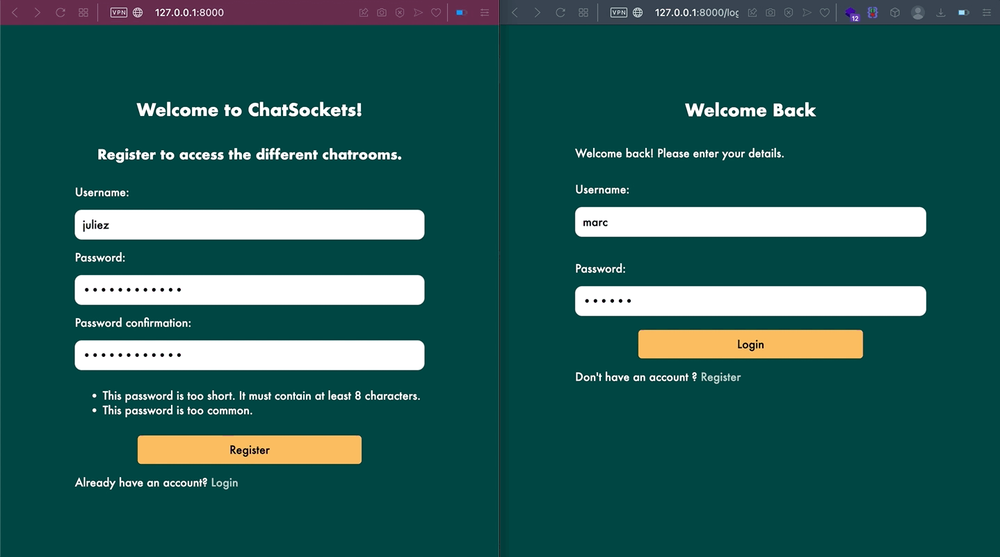

<div id="top"></div>

<!-- PROJECT SHIELDS -->
<!--
*** I'm using markdown "reference style" links for readability.
*** Reference links are enclosed in brackets [ ] instead of parentheses ( ).
*** See the bottom of this document for the declaration of the reference variables
*** for contributors-url, forks-url, etc. This is an optional, concise syntax you may use.
*** https://www.markdownguide.org/basic-syntax/#reference-style-links
-->
[![project-type][project-type-shield]][project-type-url]
[![django][django-shield]][django-url]
[![websockets][websockets-shield]][websockets-url]
[![django-channels][django-channels-shield]][django-channels-url]
[![docker][docker-shield]][docker-url]
[![redis][redis-shield]][redis-url]
[![async-await][async-await-shield]][async-await-url]


<!-- PROJECT LOGO -->
<br />
<div align="center">

<h1 align="center"> ChatSockets </h1>

  <p align="center">
   ChatSockets is a small Django App using Django Channels & WebSockets to create a chatroom.
    <br />
</p>
</div>


<a href="https://images.unsplash.com/photo-1577563908411-5077b6dc7624?ixlib=rb-4.0.3&ixid=MnwxMjA3fDB8MHxwaG90by1wYWdlfHx8fGVufDB8fHx8&auto=format&fit=crop&w=1770&q=80"><small>By Volodymyr Hryshchenko</small></a>


<!-- ABOUT THE PROJECT -->
## Project Overview



<p align="right">(<a href="#top">back to top</a>)</p>


## Built With & Tools

* Python 
* Django
* Websockets
* Django Channels
* Docker
* Redis
* HTML
* CSS / SCSS

<p align="right">(<a href="#top">back to top</a>)</p>


<!-- GETTING STARTED -->
## Getting Started

### Clone the repo

   ```sh
   git clone https://github.com/Jliezed/project_chatsockets.git
   ```

### Run the app:
#### Install venv library
   ```sh
   pip install venv
   ```
#### Create a virtual environment
   ```sh
   python -m venv env
   ```
#### Activate the virtual environment
   ```sh
   source env/bin/activate
   ```
#### Install packages using requirements.txt
   ```sh
   pip install -r requirements.txt
   ```
      
#### Migrate the database
   ```sh
   python manage.py migrate
   ```

#### Access to the App by running the server
   ```sh
   python manage.py runserver
   ```
#### Go to http://127.0.0.0:8000/ to access the app

### Run redis with docker
   ```sh
   docker run -p 6379:6379 -d redis:5
   ```

<p align="right">(<a href="#top">back to top</a>)</p>

<!-- Ressources -->
## Ressources
- [Django Channels](https://channels.readthedocs.io/en/stable/introduction.html)
- [Websockets](https://developer.mozilla.org/en-US/docs/Web/API/WebSockets_API)
- [Django Channels Tutorial - Dennis Ivy](https://www.youtube.com/watch?v=cw8-KFVXpTE)


<p align="right">(<a href="#top">back to top</a>)</p>

<!-- MARKDOWN LINKS & IMAGES -->
<!-- https://www.markdownguide.org/basic-syntax/#reference-style-links -->
[project-type-shield]: https://img.shields.io/badge/TYPE-SIDE%20PROJECT-blueviolet?style=for-the-badge
[project-type-url]: https://github.com/Jliezed/project_chatsockets

[django-shield]: https://img.shields.io/badge/DJANGO-blue?style=for-the-badge
[django-url]: https://www.djangoproject.com/

[django-channels-shield]: https://img.shields.io/badge/-DJANGO%20CHANNELS-blue?style=for-the-badge
[django-channels-url]: https://channels.readthedocs.io/en/stable/

[websockets-shield]: https://img.shields.io/badge/-WEBSOCKETS-blue?style=for-the-badge
[websockets-url]: https://en.wikipedia.org/wiki/WebSocket

[docker-shield]: https://img.shields.io/badge/-DOCKER-blue?style=for-the-badge
[docker-url]: https://www.docker.com/

[redis-shield]: https://img.shields.io/badge/-REDIS-blue?style=for-the-badge
[redis-url]: https://redis.io/

[async-await-shield]: https://img.shields.io/badge/-ASYNC%20AWAIT-blue?style=for-the-badge
[async-await-url]: https://docs.python.org/3/library/asyncio-task.html

